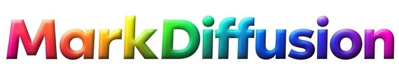
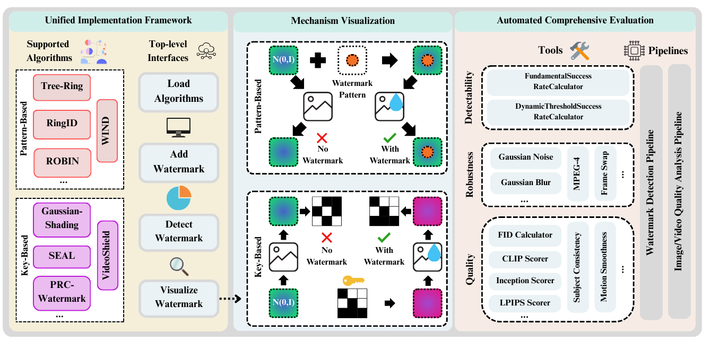

<div align="center">



# Une Boîte à Outils Open-Source pour le Tatouage Numérique Génératif des Modèles de Diffusion Latente

[](https://generative-watermark.github.io/)
[](https://arxiv.org/abs/2509.10569)
[](https://huggingface.co/Generative-Watermark-Toolkits) 
[](https://colab.research.google.com/drive/1N1C9elDAB5zwF4FxKKYMCqR3eSpCSqAW?usp=sharing) 
[](https://markdiffusion.readthedocs.io) 
[](https://pypi.org/project/markdiffusion) 
[](https://github.com/conda-forge/markdiffusion-feedstock)


**Versions linguistiques :** [English](README.md) | [中文](README_zh.md) | [Français](README_fr.md) | [Español](README_es.md)
</div>

> 🔥 **En tant que projet récemment publié, nous accueillons les PR !** Si vous avez implémenté un algorithme de tatouage numérique LDM ou si vous êtes intéressé à en contribuer un, nous serions ravis de l'inclure dans MarkDiffusion. Rejoignez notre communauté et aidez à rendre le tatouage numérique génératif plus accessible à tous !

## Sommaire
- [Mises à jour](#-mises-à-jour)
- [Introduction à MarkDiffusion](#-introduction-à-markdiffusion)
  - [Vue d'ensemble](#-vue-densemble)
  - [Caractéristiques clés](#-caractéristiques-clés)
  - [Algorithmes implémentés](#-algorithmes-implémentés)
  - [Module d'évaluation](#-module-dévaluation)
- [Démarrage rapide](#-démarrage-rapide)
    - [Démo Google Colab](#démo-google-colab)
    - [Installation](#installation)
    - [Comment utiliser la boîte à outils](#comment-utiliser-la-boîte-à-outils)
- [Modules de test](#-modules-de-test)
- [Citation](#citation)


## 🔥 Mises à jour
🛠 **(2026.05.15)** Suite de tests étendue à 672 tests unitaires avec 94,73 % de couverture de code (régression complète GPU + CPU dans le nouvel environnement `markdiffusion-test`).

🏗️ **(2026.05.10)** Restructuration du dépôt en un véritable package Python `markdiffusion/` afin que `pip install -e .` et l'installation depuis PyPI partagent les mêmes chemins d'import (`from markdiffusion.watermark import AutoWatermark`). Les installations editable et la CI utilisent désormais une mise en page unique.

🎯 **(2026.05.10)** Ajout des attaques de régénération *DiffusionPurification* et *NeuralCodecCompression* ; *CrSc* (Crop & Scale) prend désormais `position="random"` et un décalage explicite — merci aux contributeurs !

🛠 **(2025.12.19)** Ajout d'une suite de tests complète pour toutes les fonctionnalités avec 658 cas de test.

🛠 **(2025.12.10)** Ajout d'un système de tests d'intégration continue utilisant GitHub Actions.

🎯 **(2025.10.10)** Ajout des outils d'attaque d'image *Mask, Overlay, AdaptiveNoiseInjection*, merci à Zheyu Fu pour sa PR !

🎯 **(2025.10.09)** Ajout des outils d'attaque vidéo *FrameRateAdapter, FrameInterpolationAttack*, merci à Luyang Si pour sa PR !

🎯 **(2025.10.08)** Ajout des analyseurs de qualité d'image *SSIM, BRISQUE, VIF, FSIM*, merci à Huan Wang pour sa PR !

✨ **(2025.10.07)** Ajout de la méthode de tatouage [SFW](https://arxiv.org/pdf/2509.07647), merci à Huan Wang pour sa PR !

✨ **(2025.10.07)** Ajout de la méthode de tatouage [VideoMark](https://arxiv.org/abs/2504.16359), merci à Hanqian Li pour sa PR !

✨ **(2025.9.29)** Ajout de la méthode de tatouage [GaussMarker](https://arxiv.org/abs/2506.11444), merci à Luyang Si pour sa PR !

## 🔓 Introduction à MarkDiffusion

### 👀 Vue d'ensemble

MarkDiffusion est une boîte à outils Python open-source pour le tatouage numérique génératif des modèles de diffusion latente. Alors que l'utilisation des modèles génératifs basés sur la diffusion s'étend, garantir l'authenticité et l'origine des médias générés devient crucial. MarkDiffusion simplifie l'accès, la compréhension et l'évaluation des technologies de tatouage numérique, les rendant accessibles tant aux chercheurs qu'à la communauté au sens large. *Remarque : si vous êtes intéressé par le tatouage LLM (tatouage de texte), veuillez vous référer à la boîte à outils [MarkLLM](https://github.com/THU-BPM/MarkLLM) de notre groupe.*

La boîte à outils comprend trois composants clés : un cadre d'implémentation unifié pour des intégrations rationalisées d'algorithmes de tatouage et des interfaces conviviales ; une suite de visualisation de mécanismes qui présente intuitivement les motifs de tatouage ajoutés et extraits pour aider à la compréhension du public ; et un module d'évaluation complet offrant des implémentations standard de 33 outils couvrant trois aspects essentiels — détectabilité, robustesse et qualité de sortie, plus 8 pipelines d'évaluation automatisés.



### 💍 Caractéristiques clés

- **Cadre d'implémentation unifié :** MarkDiffusion fournit une architecture modulaire prenant en charge onze algorithmes de tatouage d'image/vidéo génératifs de pointe pour les LDM.

- **Support algorithmique complet :** Implémente actuellement 11 algorithmes de tatouage de deux catégories principales : méthodes basées sur les motifs (Tree-Ring, Ring-ID, ROBIN, WIND, SFW) et méthodes basées sur les clés (Gaussian-Shading, PRC, SEAL, VideoShield, GaussMarker, VideoMark).

- **Solutions de visualisation :** La boîte à outils comprend des outils de visualisation personnalisés qui permettent des vues claires et perspicaces sur le fonctionnement des différents algorithmes de tatouage dans divers scénarios. Ces visualisations aident à démystifier les mécanismes des algorithmes, les rendant plus compréhensibles pour les utilisateurs.

- **Module d'évaluation :** Avec 33 outils d'évaluation couvrant la détectabilité, la robustesse et l'impact sur la qualité de sortie, MarkDiffusion fournit des capacités d'évaluation complètes. Il comprend 8 pipelines d'évaluation automatisés : Pipeline de détection de tatouage, Pipeline d'analyse de qualité d'image, Pipeline d'analyse de qualité vidéo et outils d'évaluation de robustesse spécialisés.

### ✨ Algorithmes implémentés

| **Algorithme** | **Catégorie** | **Cible** | **Référence** |
|---------------|-------------|------------|---------------|
| Tree-Ring | Motif | Image | [Tree-Ring Watermarks: Fingerprints for Diffusion Images that are Invisible and Robust](https://arxiv.org/abs/2305.20030) |
| Ring-ID | Motif | Image | [RingID: Rethinking Tree-Ring Watermarking for Enhanced Multi-Key Identification](https://arxiv.org/abs/2404.14055) |
| ROBIN | Motif | Image | [ROBIN: Robust and Invisible Watermarks for Diffusion Models with Adversarial Optimization](https://arxiv.org/abs/2411.03862) |
| WIND | Motif | Image | [Hidden in the Noise: Two-Stage Robust Watermarking for Images](https://arxiv.org/abs/2412.04653) |
| SFW | Motif | Image | [Semantic Watermarking Reinvented: Enhancing Robustness and Generation Quality with Fourier Integrity](https://arxiv.org/abs/2509.07647) |
| Gaussian-Shading | Clé | Image | [Gaussian Shading: Provable Performance-Lossless Image Watermarking for Diffusion Models](https://arxiv.org/abs/2404.04956) |
| GaussMarker | Clé | Image | [GaussMarker: Robust Dual-Domain Watermark for Diffusion Models](https://arxiv.org/abs/2506.11444) |
| PRC | Clé | Image | [An undetectable watermark for generative image models](https://arxiv.org/abs/2410.07369) |
| SEAL | Clé | Image | [SEAL: Semantic Aware Image Watermarking](https://arxiv.org/abs/2503.12172) |
| VideoShield | Clé | Vidéo | [VideoShield: Regulating Diffusion-based Video Generation Models via Watermarking](https://arxiv.org/abs/2501.14195) |
| VideoMark | Clé | Vidéo | [VideoMark: A Distortion-Free Robust Watermarking Framework for Video Diffusion Models](https://arxiv.org/abs/2504.16359) |

### 🎯 Module d'évaluation
#### Pipelines d'évaluation

MarkDiffusion prend en charge huit pipelines, deux pour la détection (WatermarkedMediaDetectionPipeline et UnWatermarkedMediaDetectionPipeline), et six pour l'analyse de qualité. Le tableau ci-dessous détaille les pipelines d'analyse de qualité.

| **Pipeline d'analyse de qualité** | **Type d'entrée** | **Données requises** | **Métriques applicables** |  
| --- | --- | --- | --- |
| DirectImageQualityAnalysisPipeline | Image unique | Image tatouée/non tatouée générée | Métriques pour l'évaluation d'image unique | 
| ReferencedImageQualityAnalysisPipeline | Image + contenu de référence | Image tatouée/non tatouée générée + image/texte de référence | Métriques nécessitant un calcul entre image unique et contenu de référence (texte/image) | 
| GroupImageQualityAnalysisPipeline | Ensemble d'images (+ ensemble d'images de référence) | Ensemble d'images tatouées/non tatouées générées (+ ensemble d'images de référence) | Métriques nécessitant un calcul sur des ensembles d'images | 
| RepeatImageQualityAnalysisPipeline | Ensemble d'images | Ensemble d'images tatouées/non tatouées générées de manière répétée | Métriques pour évaluer des ensembles d'images générées de manière répétée | 
| ComparedImageQualityAnalysisPipeline | Deux images pour comparaison | Images tatouées et non tatouées générées | Métriques mesurant les différences entre deux images | 
| DirectVideoQualityAnalysisPipeline | Vidéo unique | Ensemble de cadres vidéo générés | Métriques pour l'évaluation vidéo globale |

#### Outils d'évaluation

| **Nom de l'outil** | **Catégorie d'évaluation** | **Description de la fonction** | **Métriques de sortie** |
| --- | --- | --- | --- |
| FundamentalSuccessRateCalculator | Détectabilité | Calculer les métriques de classification pour la détection de tatouage à seuil fixe | Diverses métriques de classification |
| DynamicThresholdSuccessRateCalculator | Détectabilité | Calculer les métriques de classification pour la détection de tatouage à seuil dynamique | Diverses métriques de classification |
| **Outils d'attaque d'image** | | | |
| Rotation | Robustesse (Image) | Attaque par rotation d'image, testant la résistance du tatouage aux transformations de rotation | Images/cadres pivotés |
| CrSc (Crop & Scale) | Robustesse (Image) | Attaque par recadrage et mise à l'échelle, évaluant la robustesse du tatouage aux changements de taille | Images/cadres recadrés/redimensionnés |
| GaussianNoise | Robustesse (Image) | Attaque par bruit gaussien, testant la résistance du tatouage aux interférences de bruit | Images/cadres corrompus par le bruit |
| GaussianBlurring | Robustesse (Image) | Attaque par flou gaussien, évaluant la résistance du tatouage au traitement de flou | Images/cadres flous |
| JPEGCompression | Robustesse (Image) | Attaque par compression JPEG, testant la robustesse du tatouage à la compression avec perte | Images/cadres compressés |
| Brightness | Robustesse (Image) | Attaque par ajustement de luminosité, évaluant la résistance du tatouage aux changements de luminosité | Images/cadres modifiés en luminosité |
| Mask | Robustesse (Image) | Attaque par masquage d'image, testant la résistance du tatouage à l'occlusion partielle par des rectangles noirs aléatoires | Images/cadres masqués |
| Overlay | Robustesse (Image) | Attaque par superposition d'image, testant la résistance du tatouage aux traits et annotations de type graffiti | Images/cadres superposés |
| AdaptiveNoiseInjection | Robustesse (Image) | Attaque par injection de bruit adaptatif, testant la résistance du tatouage au bruit adaptatif au contenu (Gaussien/Sel-poivre/Poisson/Speckle) | Images/cadres bruyants avec bruit adaptatif |
| **Outils d'attaque vidéo** | | | |
| MPEG4Compression | Robustesse (Vidéo) | Attaque par compression vidéo MPEG-4, testant la robustesse du tatouage vidéo à la compression | Cadres vidéo compressés |
| FrameAverage | Robustesse (Vidéo) | Attaque par moyennage de cadres, détruisant les tatouages par moyennage inter-cadres | Cadres vidéo moyennés |
| FrameSwap | Robustesse (Vidéo) | Attaque par échange de cadres, testant la robustesse en changeant les séquences de cadres | Cadres vidéo échangés |
| FrameRateAdapter | Robustesse (Vidéo) | Attaque par conversion de fréquence d'images qui rééchantillonne les cadres tout en préservant la durée | Séquence de cadres rééchantillonnée |
| FrameInterpolationAttack | Robustesse (Vidéo) | Attaque par interpolation de cadres insérant des cadres mélangés pour modifier la densité temporelle | Cadres vidéo interpolés |
| **Analyseurs de qualité d'image** | | | |
| InceptionScoreCalculator | Qualité (Image) | Évaluer la qualité et la diversité des images générées | Score IS |
| FIDCalculator | Qualité (Image) | Distance d'Inception de Fréchet, mesurant la différence de distribution entre images générées et réelles | Valeur FID |
| LPIPSAnalyzer | Qualité (Image) | Similarité de patch d'image perceptuelle apprise, évaluant la qualité perceptuelle | Distance LPIPS |
| CLIPScoreCalculator | Qualité (Image) | Évaluation de cohérence texte-image basée sur CLIP | Score de similarité CLIP |
| PSNRAnalyzer | Qualité (Image) | Rapport signal sur bruit de crête, mesurant la distorsion d'image | Valeur PSNR (dB) |
| NIQECalculator | Qualité (Image) | Évaluateur de qualité d'image naturelle, évaluation de qualité sans référence | Score NIQE |
| SSIMAnalyzer | Qualité (Image) | Indice de similarité structurelle entre deux images | Valeur SSIM |
| BRISQUEAnalyzer | Qualité (Image) | Évaluateur de qualité spatiale d'image aveugle/sans référence, évaluant la qualité perceptuelle d'une image sans nécessiter de référence | Score BRISQUE |
| VIFAnalyzer | Qualité (Image) | Analyseur de fidélité d'information visuelle, comparant une image déformée avec une image de référence pour quantifier la quantité d'information visuelle préservée | Valeur VIF |
| FSIMAnalyzer | Qualité (Image) | Analyseur d'indice de similarité de caractéristiques, comparant la similarité structurelle entre deux images basée sur la congruence de phase et la magnitude du gradient | Valeur FSIM |
| **Analyseurs de qualité vidéo** | | | |
| SubjectConsistencyAnalyzer | Qualité (Vidéo) | Évaluer la cohérence des objets sujets dans la vidéo | Score de cohérence du sujet |
| BackgroundConsistencyAnalyzer | Qualité (Vidéo) | Évaluer la cohérence et la stabilité de l'arrière-plan dans la vidéo | Score de cohérence de l'arrière-plan |
| MotionSmoothnessAnalyzer | Qualité (Vidéo) | Évaluer la fluidité du mouvement vidéo | Métrique de fluidité du mouvement |
| DynamicDegreeAnalyzer | Qualité (Vidéo) | Mesurer le niveau dynamique et l'amplitude de changement dans la vidéo | Valeur de degré dynamique |
| ImagingQualityAnalyzer | Qualité (Vidéo) | Évaluation complète de la qualité d'imagerie vidéo | Score de qualité d'imagerie |

## 🧩 Démarrage rapide
### Démo Google Colab
Si vous souhaitez essayer MarkDiffusion sans rien installer, vous pouvez utiliser [Google Colab](https://colab.research.google.com/drive/1N1C9elDAB5zwF4FxKKYMCqR3eSpCSqAW?usp=sharing#scrollTo=-kWt7m9Y3o-G) pour voir comment cela fonctionne.

### Installation

MarkDiffusion peut être installé de trois façons. Choisissez celle qui correspond à votre usage :

| Mode | Commande | À utiliser quand... |
|---|---|---|
| **A. PyPI (recommandé pour les utilisateurs)** | `pip install markdiffusion[optional]` | Vous voulez simplement *appeler* les algorithmes de tatouage depuis votre propre script/notebook. Pas besoin de lire ou de modifier la source de la bibliothèque, ni d'exécuter les tests ou les notebooks de démonstration. |
| **B. Installation editable depuis la source (recommandé pour contributeurs/chercheurs)** | `git clone … && cd MarkDiffusion && pip install -e ".[optional]"` | Vous voulez (a) exécuter `MarkDiffusion_demo.ipynb` / la suite de tests `test/`, (b) modifier ou ajouter des algorithmes, (c) reproduire les résultats de l'article, ou (d) soumettre des PR. Les modifications apportées à `markdiffusion/` prennent effet immédiatement. |
| **C. conda-forge (environnements conda uniquement)** | `conda install -c conda-forge markdiffusion` | Vous êtes restreint aux canaux conda. Certaines fonctionnalités avancées (dépendant de paquets PyPI-only comme `pyiqa` / `lpips`) ne sont pas incluses ; installez-les séparément si nécessaire. |

**Mode A — Installation PyPI :**

```bash
conda create -n markdiffusion python=3.11
conda activate markdiffusion
pip install markdiffusion[optional]
```

**Mode B — Installation editable depuis la source :**

```bash
git clone https://github.com/THU-BPM/MarkDiffusion.git
cd MarkDiffusion
conda create -n markdiffusion python=3.11
conda activate markdiffusion
pip install -e ".[optional]"
# (optionnel) installer les dépendances de test pour exécuter pytest, couverture, tests parallèles
pip install -r test/requirements-test.txt
```

`pyproject.toml` épingle `torch>=2.4,<2.11` et `setuptools<81` pour que le résolveur sélectionne une wheel CUDA-12.x compatible avec un pilote ≥ 525 et conserve `pkg_resources` (toujours requis par `openai-clip`).

**Mode C — conda-forge :**

```bash
conda create -n markdiffusion python=3.11
conda activate markdiffusion
conda config --add channels conda-forge
conda config --set channel_priority strict
conda install markdiffusion
```

### Comment utiliser la boîte à outils

Les mêmes chemins d'import `markdiffusion.*` fonctionnent à la fois pour l'installation PyPI et l'installation editable. Les deux notebooks de démonstration ne diffèrent que par leur portée :

- **`MarkDiffusion_pypi_demo.ipynb`** — utilisation minimale de bout en bout ; point de départ sûr pour les utilisateurs PyPI.
- **`MarkDiffusion_demo.ipynb`** — parcours exhaustif des 11 algorithmes ainsi que des outils de visualisation et des pipelines d'évaluation ; livré avec le dépôt source (Mode B).

Voici l'exemple minimal de bout en bout pour les deux modes :

```python
import torch
from markdiffusion.watermark import AutoWatermark
from markdiffusion.utils import DiffusionConfig
from diffusers import StableDiffusionPipeline, DPMSolverMultistepScheduler

device = "cuda" if torch.cuda.is_available() else "cpu"

MODEL_PATH = "huanzi05/stable-diffusion-2-1-base"
scheduler = DPMSolverMultistepScheduler.from_pretrained(MODEL_PATH, subfolder="scheduler")
pipe = StableDiffusionPipeline.from_pretrained(
    MODEL_PATH,
    scheduler=scheduler,
    torch_dtype=torch.float16 if device == "cuda" else torch.float32,
    safety_checker=None,
).to(device)

diffusion_config = DiffusionConfig(
    scheduler=scheduler,
    pipe=pipe,
    device=device,
    image_size=(512, 512),
    num_inference_steps=50,
    guidance_scale=7.5,
    gen_seed=42,
    inversion_type="ddim",
)

# AutoWatermark récupère automatiquement la config par défaut intégrée
# (markdiffusion/config/TR.json). Passez `algorithm_config=` pour la remplacer.
tr_watermark = AutoWatermark.load("TR", diffusion_config=diffusion_config)

prompt = "A beautiful landscape with mountains and a river at sunset"
watermarked_image = tr_watermark.generate_watermarked_media(input_data=prompt)
watermarked_image.save("watermarked_image.png")

detection_result = tr_watermark.detect_watermark_in_media(watermarked_image)
print(detection_result)
```

Avec le **Mode B**, vous pouvez en outre pointer `algorithm_config=` vers un JSON dans votre copie de travail (par ex. `markdiffusion/config/TR.json`) pour expérimenter avec les paramètres sans réinstaller. Depuis le dépôt source, vous pouvez aussi exécuter le notebook de démonstration de bout en bout :

```bash
jupyter nbconvert --to notebook --execute MarkDiffusion_demo.ipynb \
    --ExecutePreprocessor.kernel_name=markdiffusion \
    --ExecutePreprocessor.timeout=1800
```

## 🛠 Modules de test
Nous fournissons un ensemble complet de modules de test pour assurer la qualité du code. Le module comprend 672 tests unitaires avec 94,73 % de couverture de code. Veuillez vous référer au répertoire `test/` pour plus de détails. Voici le [rapport de couverture complet](https://thu-bpm.github.io/MarkDiffusion/ToReviewers/htmlcov/index.html) et le [rapport de résultats](https://thu-bpm.github.io/MarkDiffusion/ToReviewers/report.html?sort=result) exportés directement via pytest.

## Citation
```
@article{pan2025markdiffusion,
  title={MarkDiffusion: An Open-Source Toolkit for Generative Watermarking of Latent Diffusion Models},
  author={Pan, Leyi and Guan, Sheng and Fu, Zheyu and Si, Luyang and Wang, Zian and Hu, Xuming and King, Irwin and Yu, Philip S and Liu, Aiwei and Wen, Lijie},
  journal={arXiv preprint arXiv:2509.10569},
  year={2025}
}
```

